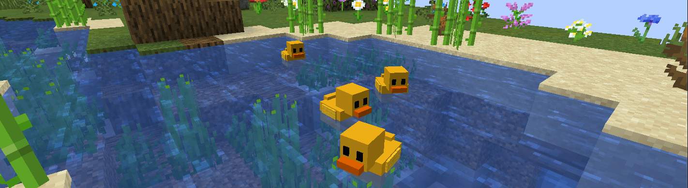
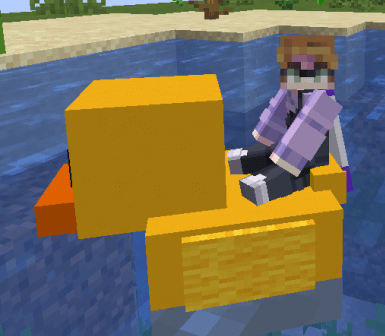

# Minecraft Ducks
This is a Minecraft plugin that adds simple ducks to the game.
I use it on [my Minecraft server](https://bingomc.net) as a fun lobby decoration.
I'm sharing the code so you can use it too! 🚀

## Spawning ducks
You can use the `/spawnduck` command to spawn a duck.
It will stay there until the server is restarted.
This is just a quick and easy way to spawn a duck.
If you really want to use this plugin for a production server,
then it would be best to make your own implementation.

## Behavior
After spawning, a duck will swim freely within
a radius of 2,5 blocks from its spawn location.
Every few seconds, it will choose a new location
(within the radius) to swim to.
Ducks have a slight vertical animation to make it
look like they're in actual (wavy) water.

### Sitting on ducks
You can sit on ducks by right-clicking them.
Your player entity will be scaled down (x0.3)
to make sure you fit on the duck.
The duck will still swim its automatically.

## Internal structure
[Duck](src/main/java/dev/jensderuiter/minecraft_ducks/duck/Duck.java)
is an abstract class that implements
[Moveable](src/main/java/dev/jensderuiter/minecraft_ducks/duck/animation/Moveable.java).
Each Duck consists of multiple
[DuckPart](src/main/java/dev/jensderuiter/minecraft_ducks/duck/DuckPart.java)'s.
These parts have one display entity per part and will rotate around the center position of the duck.

[DuckSeat](src/main/java/dev/jensderuiter/minecraft_ducks/duck/DuckSeat.java)
is also a type of part, but its main use is to allow the player to sit on the duck.

Animations are used to animate a DuckPart or the entire duck (all parts).
There is currently only one animation, the
[WaveAnimation](src/main/java/dev/jensderuiter/minecraft_ducks/duck/animation/WaveAnimation.java),
which is only used on the entire duck (no specific parts).
You can extend
[BaseDuckAnimation](src/main/java/dev/jensderuiter/minecraft_ducks/duck/animation/BaseDuckAnimation.java)
to create your own animations.

